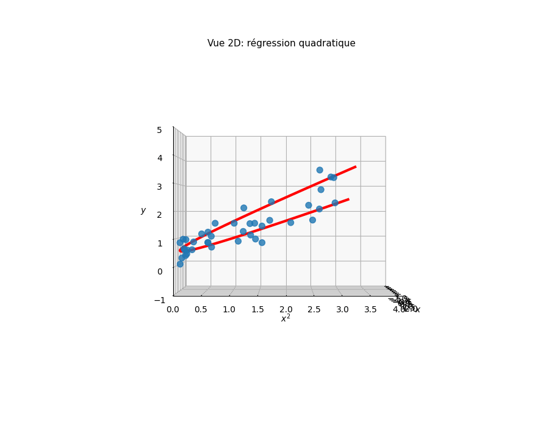

# Modèles linéaires

**Du risque empirique à la régularisation bayésienne**

IFT6390 - Fondements de l'apprentissage machine

---

## Plan

1. Minimisation du risque empirique (ERM)
2. Prédicteur de Bayes optimal
3. Solution des moindres carrés (OLS)
4. Décomposition en valeurs singulières (SVD)
5. Généralisation et surapprentissage
6. Régression ridge
7. Cadre probabiliste
8. Du MLE au MAP

---

<!-- Part 1: ERM and the Learning Problem -->

# Partie 1

## Minimisation du risque empirique

---

## Apprentissage supervisé

**Données**: $\Data = \{(\mathbf{x}_i, y_i)\}_{i=1}^N$ tirées i.i.d. de $p(\mathbf{x}, y)$

**Objectif**: Trouver $f \in \Hypothesis$ qui prédit bien sur de **nouvelles** données

**Classe d'hypothèses** $\Hypothesis$:
- Fonctions linéaires: $f(\mathbf{x}) = \mathbf{w}^\top \mathbf{x} + b$
- Polynômes de degré $k$
- Réseaux de neurones
- ...

Notes: La classe d'hypothèses encode nos hypothèses sur la forme de la relation entre entrées et sorties.

---

## Le risque (vrai)

Pour une fonction de perte $\ell(y, \hat{y})$, le **risque** est:

$$
\Risk(f) = \E_{p(\mathbf{x}, y)}[\ell(y, f(\mathbf{x}))]
$$

C'est l'erreur moyenne sur **toutes les données possibles**.

**Problème**: $p(\mathbf{x}, y)$ est **inconnue**!

Notes: Le risque mesure la performance attendue sur la vraie distribution des données, mais nous n'y avons accès qu'indirectement via un échantillon fini.

---

## Le risque empirique

Puisque le risque est inaccessible, nous l'**approximons** par la moyenne sur les données:

$$
\hat{\Risk}(f, \Data) = \frac{1}{N} \sum_{i=1}^{N} \ell(y_i, f(\mathbf{x}_i))
$$

- **Perte quadratique**: $\hat{\Risk} = \frac{1}{N}\sum_i (y_i - f(\mathbf{x}_i))^2$ (MSE)
- **Perte 0-1**: $\hat{\Risk} = \frac{1}{N}\sum_i \indicator[y_i \neq f(\mathbf{x}_i)]$ (taux d'erreur)

Notes: Par la loi des grands nombres, le risque empirique converge vers le vrai risque quand N tend vers l'infini.

---

## Minimisation du risque empirique (ERM)

**Principe**: Choisir la fonction qui minimise l'erreur d'entraînement

$$
\hat{f} = \arg\min_{f \in \Hypothesis} \hat{\Risk}(f, \Data)
$$

**Espoir**: Si $\hat{\Risk}(\hat{f})$ est faible, alors $\Risk(\hat{f})$ l'est aussi.

**Réalité**: Pas toujours vrai! → Surapprentissage

Notes: L'écart entre risque empirique et vrai risque dépend de la taille de l'échantillon et de la complexité de la classe d'hypothèses.

---

<!-- Part 2: Bayes Optimal Predictor -->

# Partie 2

## Prédicteur de Bayes optimal

---

## L'idéal théorique

Si nous connaissions la **vraie** distribution $p(\mathbf{x}, y)$, quel prédicteur minimiserait le risque?

$$
f^*(\mathbf{x}) = \arg\min_{\hat{y}} \E_{p(y|\mathbf{x})}[\ell(y, \hat{y})]
$$

Le **prédicteur de Bayes optimal**: minimise le risque pour chaque $\mathbf{x}$ individuellement.

Notes: Ce prédicteur est un repère théorique - aucun algorithme ne peut faire mieux car il suppose l'accès à la vraie distribution.

---

## Perte quadratique: dérivation

Pour $\ell(y, \hat{y}) = (y - \hat{y})^2$, développons:

$$
\E[(y - \hat{y})^2 | \mathbf{x}] = \E[y^2 | \mathbf{x}] - 2\hat{y}\E[y | \mathbf{x}] + \hat{y}^2
$$

C'est une parabole en $\hat{y}$. Dérivons:

$$
\frac{\partial}{\partial \hat{y}} = -2\E[y | \mathbf{x}] + 2\hat{y} = 0
$$

Notes: La fonction est convexe en y_hat, donc le point critique est bien un minimum.

---

## Résultat: moyenne conditionnelle

$$
\hat{y}^* = \E[y | \mathbf{x}]
$$

**Pour la perte L2, le prédicteur optimal est la moyenne conditionnelle.**

Intuition: La moyenne minimise la somme des distances carrées.

| Perte | Prédicteur optimal |
|-------|-------------------|
| Quadratique $(y-\hat{y})^2$ | Moyenne $\E[y\|\mathbf{x}]$ |
| 0-1 $\indicator[y \neq \hat{y}]$ | Mode $\arg\max_c p(y=c\|\mathbf{x})$ |

---

## Risque de Bayes

Le **risque de Bayes** est le risque du prédicteur optimal:

$$
\Risk^* = \Risk(f^*) = \E[\Var(y | \mathbf{x})]
$$

C'est l'**erreur irréductible** - le bruit intrinsèque dans les données.

**Aucun algorithme ne peut faire mieux**, peu importe la quantité de données.

Notes: Pour la perte quadratique, le risque de Bayes est la variance conditionnelle moyenne.

---

<!-- Part 3: OLS Solution -->

# Partie 3

## Moindres carrés ordinaires (OLS)

---

## Le modèle linéaire

$$
f(\mathbf{x}; \mathbf{w}) = \mathbf{w}^\top \mathbf{x} = \sum_{j=1}^{d} w_j x_j
$$

**Notation matricielle** pour $N$ exemples:

$$
\mathbf{X} = \begin{bmatrix} \mathbf{x}_1^\top \\ \vdots \\ \mathbf{x}_N^\top \end{bmatrix} \in \R^{N \times d}, \quad
\mathbf{y} = \begin{bmatrix} y_1 \\ \vdots \\ y_N \end{bmatrix} \in \R^N
$$

Prédictions: $\hat{\mathbf{y}} = \mathbf{X}\mathbf{w}$

---

## Fonction objectif: RSS

**Somme des carrés des résidus** (Residual Sum of Squares):

$$
\text{RSS}(\mathbf{w}) = \sum_{n=1}^{N} (y_n - \mathbf{w}^\top \mathbf{x}_n)^2 = \|\mathbf{y} - \mathbf{X}\mathbf{w}\|_2^2
$$

En développant:

$$
\text{RSS}(\mathbf{w}) = \mathbf{y}^\top\mathbf{y} - 2\mathbf{w}^\top\mathbf{X}^\top\mathbf{y} + \mathbf{w}^\top\mathbf{X}^\top\mathbf{X}\mathbf{w}
$$

Notes: C'est une fonction quadratique convexe en w, donc elle a un unique minimum global.

---

## Dérivation: équations normales

Gradient par rapport à $\mathbf{w}$:

$$
\nabla_\mathbf{w} \text{RSS} = -2\mathbf{X}^\top\mathbf{y} + 2\mathbf{X}^\top\mathbf{X}\mathbf{w} = 0
$$

**Équations normales**:

$$
\mathbf{X}^\top\mathbf{X}\mathbf{w} = \mathbf{X}^\top\mathbf{y}
$$

Notes: Les équations normales expriment l'orthogonalité entre le résidu et l'espace colonnes de X.

---

## Solution OLS

Si $\mathbf{X}^\top\mathbf{X}$ est inversible:

$$
\boxed{\hat{\mathbf{w}}_{\text{OLS}} = (\mathbf{X}^\top\mathbf{X})^{-1}\mathbf{X}^\top\mathbf{y}}
$$

**Interprétation géométrique**: $\hat{\mathbf{y}} = \mathbf{X}\hat{\mathbf{w}}$ est la **projection orthogonale** de $\mathbf{y}$ sur l'espace colonnes de $\mathbf{X}$.

Le résidu $\mathbf{r} = \mathbf{y} - \hat{\mathbf{y}}$ est perpendiculaire à cet espace.

---

## Visualisation: plan de régression



Notes: La solution OLS trouve le plan qui minimise la somme des distances verticales au carré.

---

<!-- Part 4: SVD for OLS -->

# Partie 4

## Solution SVD

---

## Décomposition en valeurs singulières

Toute matrice $\mathbf{X} \in \R^{N \times d}$ se décompose comme:

$$
\mathbf{X} = \mathbf{U}\mathbf{D}\mathbf{V}^\top
$$

- $\mathbf{V} \in \R^{d \times d}$: directions principales (espace des features)
- $\mathbf{D}$: valeurs singulières $d_1 \geq d_2 \geq \cdots \geq d_d \geq 0$
- $\mathbf{U} \in \R^{N \times d}$: directions dans l'espace des observations

Notes: Les colonnes de V sont les vecteurs propres de X^T X, et les valeurs singulières sont les racines carrées des valeurs propres.

---

## Interprétation géométrique

| Composante | Rôle |
|------------|------|
| $\mathbf{v}_j$ | Direction principale $j$ dans l'espace des features |
| $d_j$ | Amplitude de la transformation le long de $\mathbf{v}_j$ |
| $\mathbf{u}_j$ | Direction correspondante dans l'espace des observations |

**Grande** $d_j$ → fort signal dans cette direction

**Petite** $d_j$ → faible signal, potentiellement du bruit

---

## OLS via SVD

La solution OLS s'écrit:

$$
\hat{\boldsymbol{\theta}}_{\text{OLS}} = \sum_{j=1}^d \frac{\mathbf{u}_j^\top \mathbf{y}}{d_j} \mathbf{v}_j
$$

Chaque terme:
- $\mathbf{u}_j^\top \mathbf{y}$: projection de $\mathbf{y}$ sur la direction $j$
- Division par $d_j$: normalisation par l'amplitude

---

## Problème: instabilité numérique

$$
\hat{\boldsymbol{\theta}}_{\text{OLS}} = \sum_{j=1}^d \frac{\mathbf{u}_j^\top \mathbf{y}}{d_j} \mathbf{v}_j
$$

Si $d_j \approx 0$ (direction de faible variance):

- Division par un petit nombre → **amplification du bruit**
- La solution peut exploser
- $\mathbf{X}^\top\mathbf{X}$ est mal conditionnée

**Solution**: Régularisation (Ridge)

---

<!-- Part 5: Generalization -->

# Partie 5

## Généralisation

---

## L'écart de généralisation

$$
\text{Écart} = \Risk(f) - \hat{\Risk}(f; \Data_{\text{train}})
$$

| Risque empirique faible | Vrai risque élevé |
|------------------------|-------------------|
| ✓ Bon ajustement aux données | ✗ Mauvaise prédiction |

C'est le **surapprentissage**: le modèle mémorise le bruit.

---

## Surapprentissage: illustration

**Régression polynomiale** avec degrés croissants:

| Degré | Entraînement | Test |
|-------|--------------|------|
| 1 | Élevé | Élevé |
| 3 | Moyen | Faible |
| 15 | ~0 | Très élevé |

Avec $k = N-1$ paramètres, on peut interpoler parfaitement... mais on capture le bruit!

---

## Compromis biais-variance

$$
\E[(\hat{f}(\mathbf{x}) - y)^2] = \underbrace{\text{Biais}^2}_{\text{sous-apprentissage}} + \underbrace{\text{Variance}}_{\text{surapprentissage}} + \underbrace{\sigma^2}_{\text{irréductible}}
$$

| Complexité | Biais | Variance |
|------------|-------|----------|
| Trop simple | ↑ | ↓ |
| Trop complexe | ↓ | ↑ |

**Objectif**: Trouver le bon compromis

---

## Besoin de régularisation

**Problèmes** avec OLS:
- $\mathbf{X}^\top\mathbf{X}$ peut être singulière ou mal conditionnée
- Coefficients instables si $d \approx N$ ou features corrélées
- Surapprentissage avec beaucoup de features

**Solution**: Pénaliser la complexité du modèle

$$
\hat{\mathbf{w}} = \arg\min_\mathbf{w} \left[ \hat{\Risk}(\mathbf{w}) + \lambda \cdot C(\mathbf{w}) \right]
$$

---

<!-- Part 6: Ridge Regression -->

# Partie 6

## Régression Ridge

---

## Objectif Ridge

Ajouter une pénalité sur la norme des poids:

$$
\hat{\mathbf{w}}_{\text{ridge}} = \arg\min_\mathbf{w} \left[ \|\mathbf{y} - \mathbf{X}\mathbf{w}\|_2^2 + \lambda \|\mathbf{w}\|_2^2 \right]
$$

- $\lambda > 0$: force de la régularisation
- $\lambda = 0$: OLS standard
- $\lambda \to \infty$: $\mathbf{w} \to 0$

Notes: Le terme de pénalité empêche les coefficients d'exploser.

---

## Solution analytique Ridge

En annulant le gradient:

$$
\nabla_\mathbf{w} \left[ \|\mathbf{y} - \mathbf{X}\mathbf{w}\|^2 + \lambda\|\mathbf{w}\|^2 \right] = 0
$$

$$
-2\mathbf{X}^\top(\mathbf{y} - \mathbf{X}\mathbf{w}) + 2\lambda\mathbf{w} = 0
$$

$$
\boxed{\hat{\mathbf{w}}_{\text{ridge}} = (\mathbf{X}^\top\mathbf{X} + \lambda\mathbf{I})^{-1}\mathbf{X}^\top\mathbf{y}}
$$

L'ajout de $\lambda\mathbf{I}$ garantit l'inversibilité!

---

## Géométrie de Ridge


Notes: La contrainte sur la norme des poids définit une boule. La solution Ridge est le point où les contours de la RSS touchent cette boule.

---

## Solution Ridge via SVD

$$
\hat{\boldsymbol{\theta}}_{\text{ridge}} = \sum_{j=1}^d \underbrace{\frac{d_j^2}{d_j^2 + \lambda}}_{\text{facteur de rétrécissement}} \frac{\mathbf{u}_j^\top \mathbf{y}}{d_j} \mathbf{v}_j
$$

Le facteur $\frac{d_j^2}{d_j^2 + \lambda}$ est toujours $< 1$:

- **Grand** $d_j$: facteur $\approx 1$ (peu de rétrécissement)
- **Petit** $d_j$: facteur $\approx 0$ (fort rétrécissement)

Les directions bruitées sont **pénalisées plus fortement**!

---

## Visualisation du rétrécissement


Notes: Les directions avec de petites valeurs singulières sont rétrécies plus fortement vers zéro.

---

<!-- Part 7: Probabilistic Framework -->

# Partie 7

## Cadre probabiliste

---

## L'approche bayésienne

Au lieu de choisir une perte arbitraire, **modélisons** la génération des données:

$$
p(\boldsymbol{\theta} | \Data) = \frac{p(\boldsymbol{\theta}) \, p(\Data | \boldsymbol{\theta})}{p(\Data)}
$$

| Terme | Nom | Rôle |
|-------|-----|------|
| $p(\boldsymbol{\theta})$ | A priori | Croyances initiales |
| $p(\Data \| \boldsymbol{\theta})$ | Vraisemblance | Compatibilité données-paramètres |
| $p(\boldsymbol{\theta} \| \Data)$ | A posteriori | Croyances mises à jour |

---

## Distribution prédictive

L'approche **complètement bayésienne** moyenne sur tous les paramètres:

$$
p(y | \mathbf{x}, \Data) = \int p(y | \mathbf{x}, \boldsymbol{\theta}) \, p(\boldsymbol{\theta} | \Data) \, d\boldsymbol{\theta}
$$

Intègre l'**incertitude sur les paramètres** dans la prédiction.

---

## Problème: intégrale intractable

$$
p(y | \mathbf{x}, \Data) = \int p(y | \mathbf{x}, \boldsymbol{\theta}) \, p(\boldsymbol{\theta} | \Data) \, d\boldsymbol{\theta}
$$

- En haute dimension, cette intégrale est **impossible à calculer**
- Espace des paramètres de dimension $d$ → intégration sur $\R^d$

**Solution**: Estimateurs ponctuels
- Maximum de vraisemblance (MLE)
- Maximum a posteriori (MAP)

---

## Estimateurs ponctuels

Au lieu d'intégrer sur $\boldsymbol{\theta}$, on en choisit **un seul**:

| Estimateur | Formule |
|------------|---------|
| MLE | $\hat{\boldsymbol{\theta}} = \arg\max_{\boldsymbol{\theta}} p(\Data \| \boldsymbol{\theta})$ |
| MAP | $\hat{\boldsymbol{\theta}} = \arg\max_{\boldsymbol{\theta}} p(\boldsymbol{\theta} \| \Data)$ |

Le MLE ignore l'a priori. Le MAP trouve le **mode** de l'a posteriori.

---

<!-- Part 8: MLE to MAP -->

# Partie 8

## Du MLE au MAP

---

## Maximum de vraisemblance (MLE)

$$
\hat{\boldsymbol{\theta}}_{\text{MLE}} = \arg\max_{\boldsymbol{\theta}} \prod_{i=1}^N p(y_i | \mathbf{x}_i; \boldsymbol{\theta})
$$

En passant au log:

$$
\hat{\boldsymbol{\theta}}_{\text{MLE}} = \arg\min_{\boldsymbol{\theta}} \underbrace{-\sum_{i=1}^N \log p(y_i | \mathbf{x}_i; \boldsymbol{\theta})}_{\text{Log-vraisemblance négative (NLL)}}
$$

Avec bruit gaussien $\mathcal{N}(y | \mathbf{w}^\top\mathbf{x}, \sigma^2)$:

$$
\text{NLL} \propto \sum_i (y_i - \mathbf{w}^\top\mathbf{x}_i)^2 = \text{RSS}
$$

**MLE = OLS** sous bruit gaussien!

---

## Maximum a posteriori (MAP)

$$
\hat{\boldsymbol{\theta}}_{\text{MAP}} = \arg\max_{\boldsymbol{\theta}} p(\boldsymbol{\theta} | \Data) = \arg\max_{\boldsymbol{\theta}} p(\Data | \boldsymbol{\theta}) \, p(\boldsymbol{\theta})
$$

En passant au log:

$$
\hat{\boldsymbol{\theta}}_{\text{MAP}} = \arg\min_{\boldsymbol{\theta}} \left[ \underbrace{-\log p(\Data | \boldsymbol{\theta})}_{\text{NLL}} + \underbrace{(-\log p(\boldsymbol{\theta}))}_{\text{Régularisation}} \right]
$$

**L'a priori devient un terme de régularisation!**

---

## A priori gaussien

Supposons un a priori gaussien isotrope:

$$
p(\boldsymbol{\theta}) = \mathcal{N}(\boldsymbol{\theta} | 0, \tau^2 \mathbf{I})
$$

Le log-prior est:

$$
-\log p(\boldsymbol{\theta}) = \frac{1}{2\tau^2}\|\boldsymbol{\theta}\|_2^2 + \text{constante}
$$

C'est une pénalité L2 sur les paramètres!

---

## MAP = Ridge

Avec vraisemblance gaussienne et a priori gaussien:

$$
\hat{\boldsymbol{\theta}}_{\text{MAP}} = \arg\min_{\boldsymbol{\theta}} \left[ \frac{1}{2\sigma^2}\|\mathbf{y} - \mathbf{X}\boldsymbol{\theta}\|^2 + \frac{1}{2\tau^2}\|\boldsymbol{\theta}\|^2 \right]
$$

$$
\boxed{\lambda = \frac{\sigma^2}{\tau^2}}
$$

| $\tau^2$ grand | A priori large | $\lambda$ petit | Peu de régularisation |
|----------------|----------------|-----------------|----------------------|
| $\tau^2$ petit | A priori concentré | $\lambda$ grand | Forte régularisation |

---

## Synthèse: deux perspectives, mêmes algorithmes

```{mermaid}
graph LR
    subgraph decision [Perspective décisionnelle]
        A[Perte L2] --> B[RSS]
        B --> C[OLS]
        B --> D[+ Régul. L2]
        D --> E[Ridge]
    end
    subgraph prob [Perspective probabiliste]
        F[Bruit gaussien] --> G[MLE]
        G --> C
        G --> H[+ Prior gaussien]
        H --> I[MAP]
        I --> E
    end
```

**Perte quadratique** ↔ **Bruit gaussien**

**Régularisation L2** ↔ **A priori gaussien**

---

## Résumé

1. **ERM**: Minimiser l'erreur sur les données d'entraînement
2. **Bayes optimal**: La moyenne conditionnelle minimise la perte L2
3. **OLS**: Solution analytique $(X^\top X)^{-1}X^\top y$
4. **SVD**: Révèle l'instabilité (petites valeurs singulières)
5. **Ridge**: Régularisation L2 → $(X^\top X + \lambda I)^{-1}X^\top y$
6. **Cadre probabiliste**: MLE = OLS, MAP avec prior gaussien = Ridge

---

## Questions?

**Références**:
- Chapitre "Le problème d'apprentissage" du livre
- Chapitre "Régression linéaire" (drafts)

**Exercices recommandés**:
- Exercice 14: Prédicteur de Bayes optimal
- Exercice 11: MAP et régression ridge
- Exercice 16: SVD et facteurs de rétrécissement
